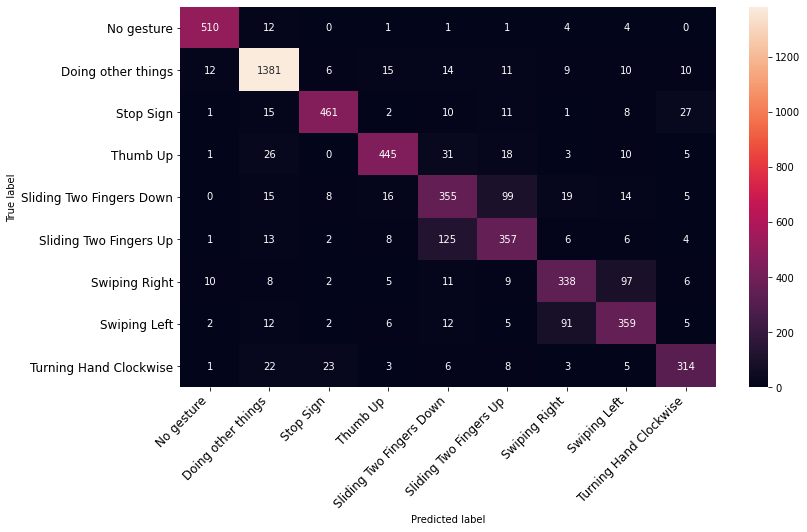
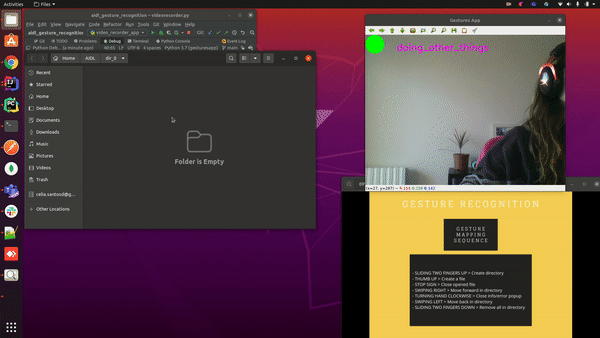
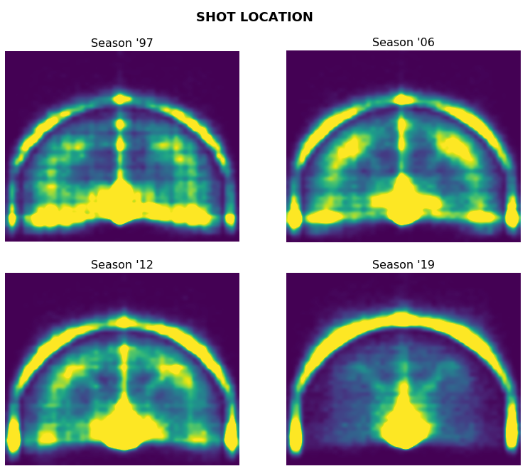
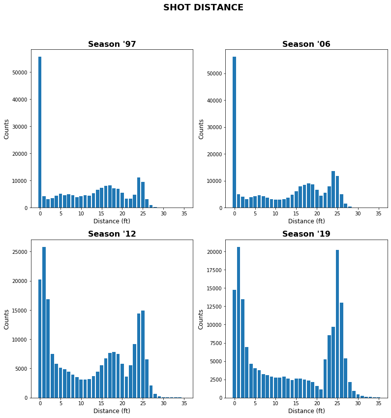

# PORTFOLIO

I'm Gerard Pons Recasens, an **Engineering Physics** graduate and **Data Science Master's** sudent. Here is my portfolio, where I showcase some recent work and small projects.

# [PROJECT 1: END-TO-END GESTURE RECOGNITION CONTROL SYSTEM](https://github.com/gesturesAidl/video_processor)

* **Team project** in which some Linux OS functionalities where controlled by gestures.
* We deployed a **Deep Learning model** to predict the gestures made by the user, using **Transfer Learning** from **state-of-the-art models**.
* Worked with **large volumes** of data, performed **data cleaning** , **feature engineering** and **data augmentation**.
* Created a pipline brokered with **RabbitMQ**, where the user recorded videos were sent to our **Google Cloud** machine, were processed and predicted there, and the action to perform was sent back to the user's device.
* Worked collabaratively in **GitHub**, and used **Python** with the ML library **PyTorch**.
* A **demo** of the full process working can be seen [here](https://www.youtube.com/watch?v=G59jl27JF2A&ab_channel=GesturesAidl).

  
  

# [PROJECT 2: NBA: 3-POINT SHOTS INSIGHTS](https://github.com/gerardponsds/NBA_Shot_Analysis)

* **Data visualization** and **storytelling** with data about NBA shot statistics from seasons 97'-98' to 19'-20'.
* **Played and explored** with the data using different approches. 
* Posed and answered questions and **drew conclusions** from it.
* Used **Python**, with the library **Pandas** for data manipulation and **MatPlotLib** for visaulization.

  
  

